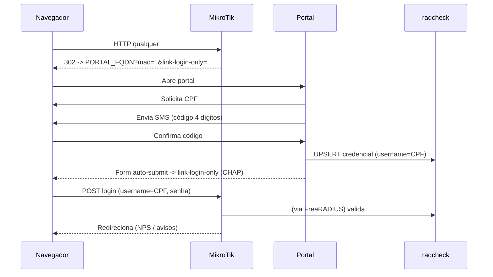

# 04 — Integração com o Portal Externo

Como o **portal externo Hostspost** (login por CPF/SMS/Google, termos LGPD, NPS) conversa
com o MikroTik e com o FreeRADIUS. O código do portal está fora deste repositório; aqui
descreve-se o **contrato de integração**.

## 4.1 Fluxo geral

1. O dispositivo conecta no Wi-Fi de visitantes e abre qualquer site.
2. O MikroTik redireciona para o **portal externo** (`PORTAL_FQDN`), liberado no walled
   garden (ver [02](02-mikrotik-hotspot.md)). O RouterOS anexa parâmetros úteis à URL de
   redirect: `mac`, `ip`, `link-login`, `link-orig`, `link-login-only`.
3. O usuário se identifica (CPF + SMS, ou Google).
4. O portal **grava/atualiza a credencial** no banco (`radcheck`), usando o **CPF como
   `username`**.
5. O portal faz o dispositivo **enviar o login ao MikroTik** (`link-login-only`) com a
   credencial, via CHAP.
6. O MikroTik valida no FreeRADIUS → `Access-Accept` → internet liberada.
7. (Opcional) redirect final para a **pesquisa NPS** ou página de avisos.



## 4.2 Verificação por SMS (código de 4 dígitos)

- O portal gera o código, envia pelo **gateway SMS** (domínio liberado no walled garden)
  e valida a entrada do usuário.
- Só **após** validar o código o portal grava a credencial em `radcheck`. Sugestão de
  senha: token aleatório de uso único armazenado no `radcheck` (o usuário nunca digita
  senha; o portal injeta no form de login do hotspot).

```sql
-- UPSERT da credencial após validar o SMS (username = CPF)
INSERT INTO radcheck (username, attribute, op, value)
VALUES ('CPF', 'Cleartext-Password', ':=', 'TOKEN_ALEATORIO')
ON DUPLICATE KEY UPDATE value = 'TOKEN_ALEATORIO';
```

> **Toggle "Verificação por SMS":** quando desligado no painel admin, o portal apenas
> pula a etapa do código — **não** exige mudança no MikroTik/RADIUS.

## 4.3 Login com Google (OAuth)

- Fluxo OAuth 2.0 padrão entre o portal e o Google (domínios liberados no walled garden:
  `accounts.google.com`, `*.googleapis.com`, `*.gstatic.com`).
- Após o callback validado, o portal associa a conta ao registro do visitante e grava a
  credencial em `radcheck` da mesma forma que no fluxo SMS.
- O CPF continua sendo o identificador para **limite de dispositivos** e relatórios; o
  Google é apenas o método de verificação de identidade.

## 4.4 Reconexão automática por 30 dias

Duas camadas cooperam:

1. **`mac-cookie` no MikroTik** (`mac-cookie-timeout=30d`, ver
   [02](02-mikrotik-hotspot.md)): o hotspot reconhece o dispositivo e reautentica sem
   passar pelo portal, dentro da validade.
2. **Registro por MAC no RADIUS** (opcional, reforço): o portal pode manter uma entrada
   por MAC com validade, permitindo revalidar via RADIUS.

```sql
-- (opcional) auto-login por MAC com expiração de 30 dias
INSERT INTO radcheck (username, attribute, op, value)
VALUES ('AA-BB-CC-DD-EE-FF', 'Cleartext-Password', ':=', 'AA-BB-CC-DD-EE-FF');
INSERT INTO radcheck (username, attribute, op, value)
VALUES ('AA-BB-CC-DD-EE-FF', 'Expiration', ':=', 'DD Mon YYYY');  -- data +30 dias
```

> **Toggle "Reconexão automática 30 dias":** ligado → mantém `mac-cookie-timeout=30d`.
> Desligado → reduzir o `mac-cookie-timeout` (ou usar `login-by=http-chap` sem
> mac-cookie), forçando novo login. Um valor menor exige reautenticação mais frequente.

## 4.5 Pesquisa NPS pós-conexão

Após o `Access-Accept`, o MikroTik pode redirecionar para uma URL final. Configure no
perfil/portal o redirect para a página de NPS do portal:

```routeros
/ip hotspot walled-garden add dst-host=PORTAL_FQDN comment="inclui rota /nps"
```

O NPS é coletado e armazenado **pelo portal/app**, não pelo RADIUS. Ele entra no relatório
mensal como métrica de satisfação (ver [05](05-recursos-v2-para-infra.md)).

## 4.6 Páginas de avisos, banner de campanha e termo LGPD em áudio

São recursos **de UI do portal** (avisos do hospital, banner de vacinação, leitura em voz
alta do termo LGPD via *text-to-speech*). Do ponto de vista de infraestrutura:

- Não exigem configuração de RADIUS.
- Exigem apenas que os **domínios de mídia/assets** usados estejam no walled garden se
  forem carregados **antes** do login.
- Os toggles do painel apenas ativam/desativam essas telas no portal.

Prossiga para [05-recursos-v2-para-infra.md](05-recursos-v2-para-infra.md).
