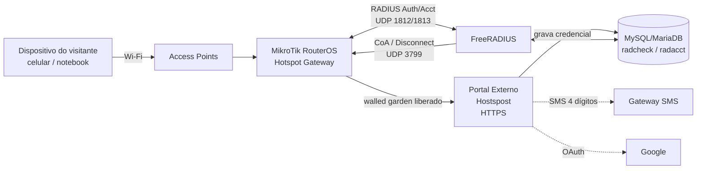
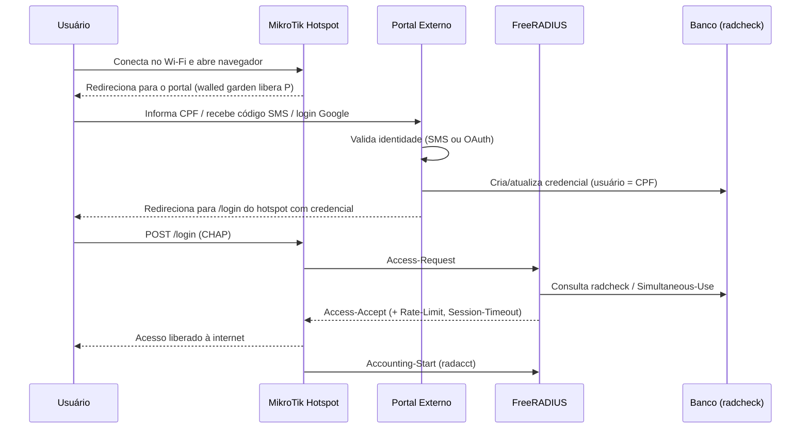

# Documentação de Implantação — Hostspost

Guia técnico para colocar o portal cativo **Hostspost** em produção com **MikroTik
(RouterOS)** + **FreeRADIUS**.

## Índice

1. [Arquitetura](01-arquitetura.md) — componentes, topologia, portas e requisitos.
2. [MikroTik / Hotspot](02-mikrotik-hotspot.md) — configuração do RouterOS, walled
   garden, perfis e limitação de banda.
3. [FreeRADIUS](03-freeradius.md) — instalação, backend SQL, clients e testes.
4. [Integração com o Portal](04-integracao-portal.md) — SMS, Google OAuth, reconexão de
   30 dias e NPS.
5. [Recursos V2 → Infraestrutura](05-recursos-v2-para-infra.md) — como cada recurso do
   painel admin é implementado na rede.
6. [Segurança e LGPD](06-seguranca-lgpd.md) — conformidade legal, criptografia e
   auditoria.
7. [Checklist de Implantação](07-checklist-implantacao.md) — go-live, testes de aceite e
   rollback.

## Visão geral da arquitetura

## Fluxo de autenticação (resumido)

## Componentes principais

| Componente | Papel | Tecnologia |
|-----------|-------|-----------|
| Gateway / Hotspot | Intercepta o tráfego, aplica walled garden, banda e filtro | MikroTik RouterOS |
| Servidor AAA | Autentica, autoriza e registra sessões (accounting) | FreeRADIUS 3.x |
| Banco de dados | Armazena credenciais e accounting | MySQL / MariaDB |
| Portal externo | UI de login (CPF/SMS/Google), termos LGPD, NPS, avisos | App Hostspost (fora deste repo) |
| Painel admin | Toggles, blacklist, filtros, relatórios | App Hostspost (fora deste repo) |

Prossiga para [01-arquitetura.md](01-arquitetura.md).
